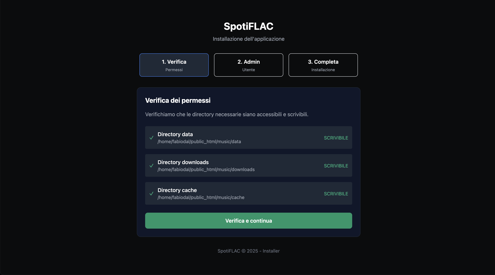
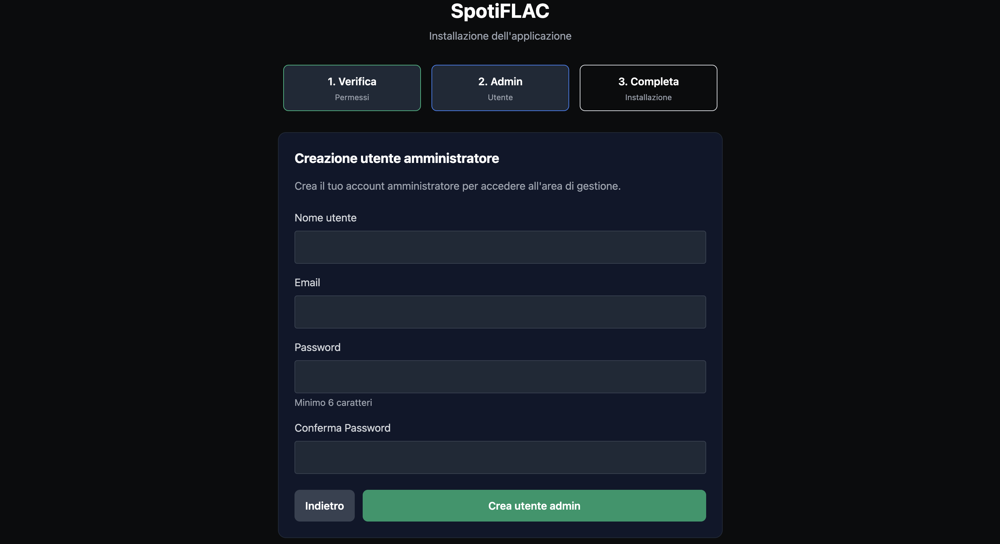
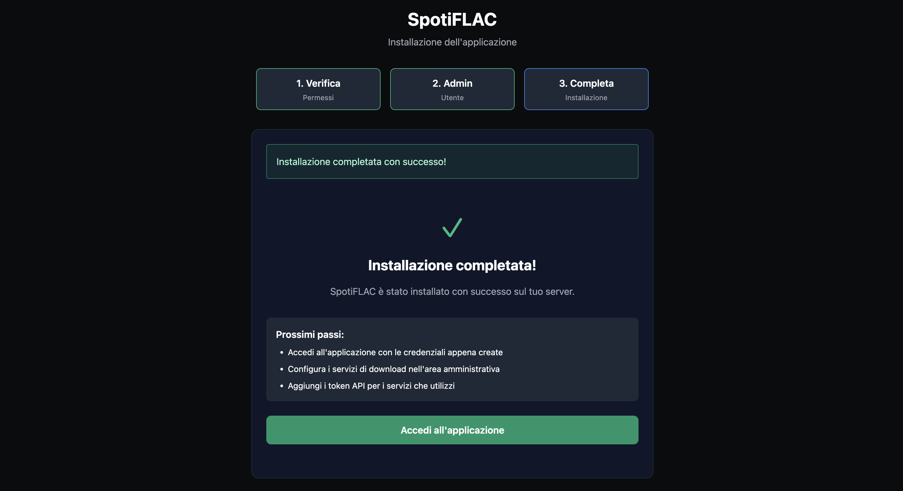
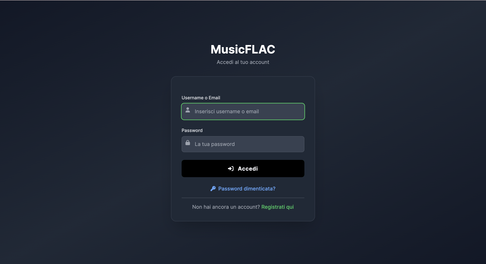
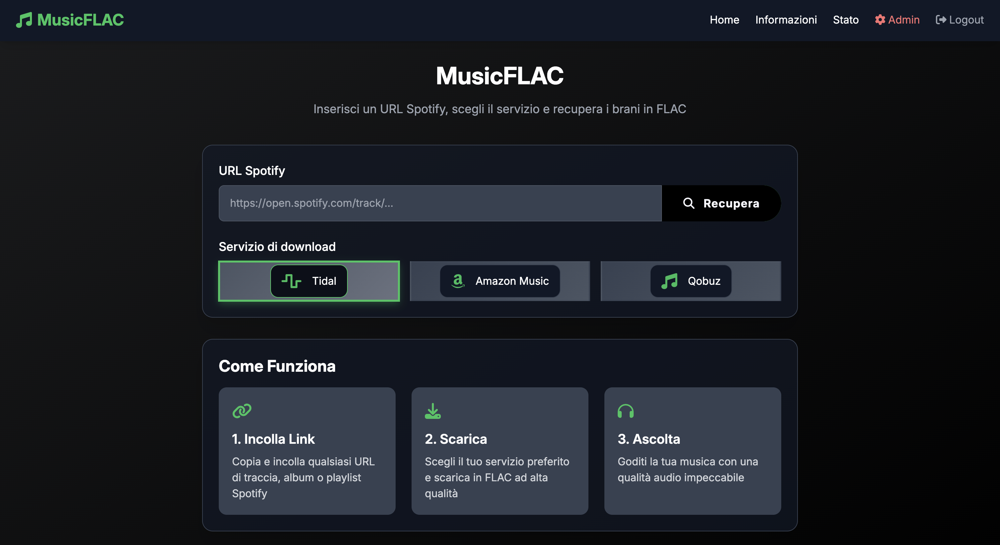
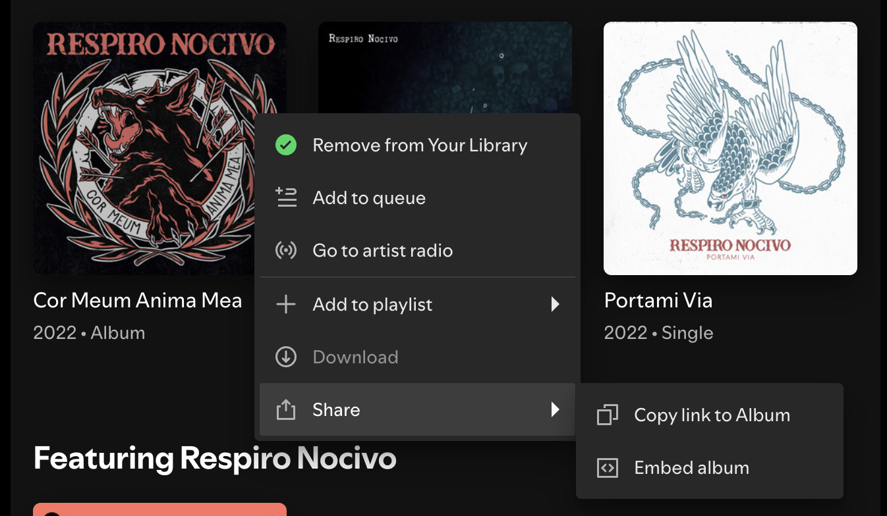
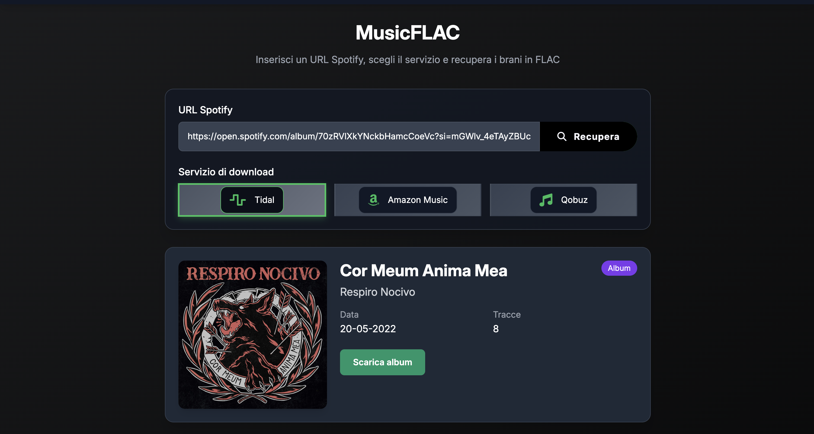
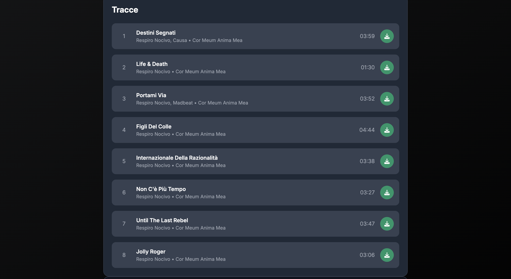

# MusicFLAC 🎵

[](LICENSE)
[](https://github.com/Fabiodalez/musicflac/issues)
[](https://github.com/Fabiodalez/musicflac/stargazers)
[](https://github.com/Fabiodalez/musicflac/network/members)
[](https://github.com/Fabiodalez/musicflac/commits)


**MusicFLAC** is a modern web application that allows you to download music tracks in **lossless FLAC format** with CD quality directly from Spotify links. The application uses **ISRC (International Standard Recording Code)** to uniquely identify tracks and automatically find them on premium services like **Tidal**, **Qobuz**, and **Amazon Music**.

> ⚠️ **Alpha Version**: This application is still in active development. Contributions, bug reports, and feedback are very welcome!

## 🔍 How It Works

**MusicFLAC** uses an intelligent approach to ensure maximum audio quality:

1. 🎯 **Spotify Link Analysis**: Enter any Spotify URL (track, album, or playlist)
2. 🔢 **ISRC Extraction**: The app extracts the unique **International Standard Recording Code** for each track
3. 🔍 **Automatic Search**: Uses ISRC codes to find the same tracks on premium services
4. 📥 **FLAC Download**: Automatically downloads in lossless CD quality format
5. 📦 **Organization**: Single tracks or complete albums organized in ZIP files

**No configuration required** - everything happens automatically!

## 🎯 Why FLAC?

**FLAC (Free Lossless Audio Codec)** is the reference audio format for audiophiles:

- 🔊 **Authentic CD Quality**: 16-bit/44.1kHz without any quality loss
- 📦 **Intelligent Compression**: Reduces file size by 30-50% while maintaining original audio
- 🎧 **Universal Compatibility**: Supported by all professional audio players
- 📈 **Future-Proof**: Superior quality audio archive for your collection
- 🔄 **Lossless Conversion**: Convert to any format without degradation

*Forget compressed MP3 and AAC - experience music as the artist created it!*

## ✨ Key Features

- 🎯 **Superior Audio Quality**: Downloads exclusively in **lossless FLAC** at CD quality
- 🎵 **Complete Spotify Support**: Paste any Spotify link (single track, complete album, or playlist)
- 🔢 **ISRC-Based Search**: Precise track identification through international standard codes
- 🔄 **Automatic Premium Services**: Tidal, Qobuz, and Amazon Music as high-quality audio sources
- 📱 **Modern Interface**: Responsive dark/light design optimized for desktop and mobile
- 👥 **Advanced User Management**: Authentication system with admin approval
- 📊 **Administrative Dashboard**: Detailed statistics, user management, and service configuration
- ⚡ **Intelligent Downloads**: Single FLAC tracks or complete albums in ZIP format
- 🧹 **Automatic Cleanup**: Automatic removal of temporary files (configurable)
- 🎚️ **Advanced Debug**: Separate debug controls for frontend and backend
- 📈 **Real-time Statistics**: Download monitoring, active users, and most used services

## 🖼️ Visual Installation Guide

### Guided Installation Process

#### 1. Dependencies and Permissions Check
The installer automatically checks all system requirements, PHP extensions, and directory permissions.



#### 2. Administrator User Creation
Configure the first administrator user of the application with username, email, and secure password.



#### 3. Installation Completed
Database created successfully! The application is ready to use and properly configured.



### Using the Application

#### 4. Login and User Registration
Log in with admin credentials or register for a new account. New registrations require approval from an administrator.



#### 5. Main Interface
Clean and intuitive interface with Spotify URL bar and automatic selection of available download services.



#### 6. Copy Link from Spotify
Copy the link of any content from Spotify: single tracks, complete albums, or playlists.



#### 7. Automatic Metadata Retrieval
Press "Fetch" to automatically get all metadata via ISRC (title, artist, artwork, duration, etc.).



#### 8. Download Options
Choose whether to download the entire album/playlist as ZIP or select individual tracks for FLAC download.



## 🚀 Installation

### System Requirements

- **PHP 7.4+** (strongly recommended **PHP 8.x**)
- **Required PHP Extensions**:
  - `PDO SQLite` (database)
  - `cURL` (API calls)
  - `Zip` (archive creation)
  - `OpenSSL` (security)
  - `JSON` (data parsing)
  - `mbstring` (string handling)
- **Web Server**: Apache, Nginx, or built-in PHP server for development
- **Stable Internet Connection**
- **Write permissions** for directories: `data/`, `downloads/`, `cache/`

### Step-by-Step Installation

1. **Clone the Repository**
   ```bash
   git clone https://github.com/Fabiodalez/musicflac.git
   cd musicflac
   ```

2. **Prepare Directories**
   ```bash
   # Create necessary directories
   mkdir -p data downloads cache
   
   # Set correct permissions
   chmod -R 755 data downloads cache
   
   # If your hosting requires specific owner:
   # chown -R www-data:www-data data downloads cache
   ```

3. **Upload to Server**
   - Upload all files maintaining the directory structure
   - Ensure the web server can execute PHP files

4. **Run the Installer**
   
   **🌐 With Web Server (Production):**
   ```
   https://yourdomain.com/installer/
   ```
   
   **💻 With Built-in PHP Server (Development):**
   ```bash
   php -S 127.0.0.1:8080 -t .
   ```
   Then open: `http://127.0.0.1:8080/installer/`

5. **Follow the Guided Procedure**
   - ✅ Automatic verification of dependencies and permissions
   - 👤 First administrator user creation
   - 💾 SQLite database configuration
   - 🎉 Installation completed!

6. **First Access**
   - Log in with the created admin credentials
   - The application is **ready to use immediately**
   - Start downloading music in FLAC quality right away!

## 🎵 Immediate Usage

**MusicFLAC** is designed to be used immediately after installation:

1. **Access the application** with admin credentials
2. **Paste a Spotify link** in the main bar
3. **Select your preferred service** (Tidal, Qobuz, Amazon Music)
4. **Press "Fetch"** - the app automatically finds tracks via ISRC
5. **Download** single FLAC tracks or complete albums in ZIP

**No additional configuration required!**

## 🏗️ Project Structure

```
MusicFLAC/
├── 📁 admin/              # Administrative area
│   ├── index.php          # Admin dashboard
│   ├── users.php          # User management
│   ├── service.php        # Available services management
│   ├── settings.php       # System settings
│   └── stats.php          # Statistics and analytics
├── 📁 data/               # SQLite database (writable)
├── 📁 downloads/          # Generated FLAC/ZIP files (writable)
├── 📁 cache/              # Temporary cache (writable)
├── 📁 includes/           # Core: bootstrap, config, auth, services, helpers
├── 📁 installer/          # Installation and upgrade scripts
├── 📁 js/                 # Frontend logic and UX helpers
├── 📁 css/                # Stylesheets
├── 📁 img/                # Images and assets
├── 🔧 api.php             # API endpoints
├── 🏠 index.php           # Frontend home
├── 🔐 login.php           # Authentication system
├── 📊 tracks.php          # Track display
├── 📄 about.php           # Information page
├── 📊 status.php          # System status
├── 🚪 logout.php          # Logout
├── 📝 signup.php          # User registration
└── 🔒 serve.php           # Secure file serving by name
```

## 🔧 Advanced Features

### 👥 User Management and Authentication
- **Free registration** with admin approval
- **Differentiated roles**: standard users and administrators
- **Secure sessions**: HTTP-only cookies, SameSite, secure when HTTPS is active
- **Per-user statistics**: download tracking and analytics

### 📊 Administrative Dashboard
- **Real-time statistics**: downloads, active users, services used
- **Service management**: enable/disable Tidal, Qobuz, Amazon Music
- **Endpoint override**: ability to override base URLs per service
- **Debug controls**: separate for frontend and backend
- **Data export**: CSV of download statistics
- **User management**: activate/deactivate, promote/demote admin, delete users

### ⚙️ System Settings
- **Download concurrency**: configure from 1 to 8 simultaneous downloads
- **Automatic cleanup**: configure timeout for temporary files (default: 1 hour)
- **Granular debug**: 
  - **Frontend Debug UI**: show/hide debug panel in interface
  - **Backend Debug (PHP)**: enable/disable server logging and browser console
- **Admin password change**: modify administrator credentials

### 🎛️ Advanced Debug Controls
Two independent controls in **Admin → Settings**:

- **Frontend Debug UI**: controls only the visibility of the debug panel/button
- **Backend Debug (PHP)**: master switch for server logging and browser console
  - **When DISABLED**: nothing is written to `debug.log` and all `console.*` calls are silenced
  - **When ENABLED**: server writes to `debug.log` and browser console works normally

**Log path**: `php/debug.log` (rotation not provided by the app)

## 🗄️ Database Schema

SQLite database created in `data/app.sqlite` with tables:

```sql
-- System settings
settings (key TEXT PRIMARY KEY, value TEXT)

-- Available services
services (id INTEGER PK, name TEXT UNIQUE, enabled INTEGER, endpoint TEXT, config TEXT, notes TEXT)

-- API tokens (if needed)
tokens (id INTEGER PK, service_id INTEGER, name TEXT, value TEXT, updated_at TEXT)

-- Users
users (id INTEGER PK, username, email, password_hash, is_active, is_admin, created_at, last_login, reset_token, reset_token_expires)

-- Download logs
downloads (id INTEGER PK, user_id, username, type, title, spotify_url, service, file_size, ip_address, user_agent, downloaded_at, meta)

-- Active downloads
active_downloads (id INTEGER PK, job_id, title, started_at)

-- System jobs
jobs (job_id TEXT PK, type, total, completed, started_at, finished_at)
```

## 🔌 API Reference

The app uses `api.php` internally. Main endpoints:

### GET Endpoints
- `GET /api.php?action=status` - Basic system health information
- `GET /api.php?action=services` - List available services and enable flags

### POST Endpoints
- `POST /api.php?action=fetch_metadata` (`application/x-www-form-urlencoded`)
  - Parameters: `url=<spotify_url>`
  - Returns: normalized metadata for track/album/playlist

- `POST /api.php?action=prepare_track` (JSON)
  - Body: `{ service, track, job_id? }`
  - Returns: `{ ok, file }` - downloads single FLAC track

- `POST /api.php?action=prepare_album` (JSON)
  - Body: `{ service, tracks, album, job_id? }`
  - Returns: `{ ok, file }` - creates ZIP with multiple tracks

- **Other UI endpoints**: `active_downloads`, `job_status`

**Note**: All API endpoints require authenticated user and respect service enablement status.

## ⚙️ Advanced Configuration

### Main constants (`includes/config.php`):
- `DOWNLOAD_DIR`: generated files directory (default: `downloads/`)
- `CACHE_DIR`: cache directory (default: `cache/`)
- `DOWNLOAD_EXPIRY_TIME`: cleanup threshold in seconds (default: `3600`)
- `SUPPORTED_SERVICES`: list of supported service keys and names
- `*_API_URL`: default base endpoints per service (overridable in Admin)
- `USER_AGENT`: default user-agent for external requests
- `DEBUG_LOG_FILE`: absolute path to `debug.log`

### Runtime settings (DB; Admin → Settings):
- `download_concurrency` (1–8)
- `frontend_debug` (0/1) 
- `backend_debug` (0/1)

## 💻 Local Development

For quick testing without Apache/Nginx:

```bash
cd musicflac
php -S 127.0.0.1:8080 -t .
# Visit: http://127.0.0.1:8080/installer/install.php
```

**Note**: Some hosts may require `.htaccess` or server rules for PHP handling; this app uses direct `*.php` endpoints and doesn't require URL rewriting.

## ⬆️ Upgrading

1. Back up your database: copy `data/app.sqlite`
2. Replace application files with the new release (keep `data/`, `downloads/`, and `cache/`)
3. Visit `installer/upgrade.php` if present to run migrations
4. Clear browser cache and reload the app
5. Verify Admin → Stats and basic flows

## 🔐 Security and Best Practices

- **Hardened sessions**: HTTP-only cookies, SameSite, secure when HTTPS detected
- **CSRF protection**: tokens protect POST actions in admin  
- **Escaped output**: all outputs are escaped with `htmlspecialchars()`
- **Avoid public exposure**: review legal/compliance aspects before exposure
- **Log rotation**: use OS logrotate for `debug.log` if backend debug active

### 📋 Installation and Deployment Notes

- **Subdirectory support**: app calculates base URL at runtime, so hosting under subfolder like `/music` works
- **File permissions**: `data/`, `downloads/`, and `cache/` must be writable by web server
- **Automatic cleanup**: background cleanup runs per request to delete old files in `downloads/` and `cache/`
- **Installer redirect**: any page redirects to `installer/install.php` until app is fully installed

## 🛠️ Troubleshooting

### ❌ Common Errors and Solutions

**📁 Non-writable directories**
```bash
# Set correct permissions
chmod -R 755 data downloads cache

# On some hosting it might be necessary:
chown -R www-data:www-data data downloads cache
```

**💾 Database error or corruption**
```bash
# Delete database and re-run installer
rm data/app.sqlite

# Navigate to: https://yourdomain.com/installer/
```

**🔧 Missing PHP extensions**
```bash
# Ubuntu/Debian
sudo apt update
sudo apt install php-sqlite3 php-curl php-zip php-mbstring php-json php-openssl

# CentOS/RHEL/AlmaLinux
sudo yum install php-pdo php-curl php-zip php-mbstring php-json php-openssl

# Verify installation
php -m | grep -E "(sqlite|curl|zip|json|mbstring|openssl)"
```

**📂 Subdirectory issues**
- The application automatically calculates base URL at runtime
- Ensure web server serves PHP files correctly in the subfolder
- Verify there are no restrictions in Apache/Nginx configurations

**🔄 "Not installed" redirect loop**
- App bootstrap automatically redirects to installer until:
  - Database `data/app.sqlite` doesn't exist or isn't valid
  - At least one administrator user doesn't exist
- **Solution**: Complete installation via `/installer/`

**🐛 Debug not working**
- **To enable full logging**: Admin → Settings → "Backend Debug (PHP)" 
- **To show debug panel**: Admin → Settings → "Frontend Debug UI"
- **Log file**: check `php/debug.log` in app directory
- **Browser console**: only works if "Backend Debug (PHP)" is enabled

**🔒 SQLite/Database errors**
```bash
# Check data directory permissions
ls -la data/

# Test file creation in directory
touch data/test.txt && rm data/test.txt

# Verify SQLite is installed
php -m | grep sqlite

# Manual database test
sqlite3 data/app.sqlite ".tables"
```

**🌐 Network/API issues**
- Verify server has Internet access
- Check firewall that might block outgoing connections
- Test connectivity manually:
```bash
curl -I https://api.spotify.com/
```

### 📋 Complete Troubleshooting Checklist

#### 🔧 System Requirements
- ✅ **PHP 7.4+** installed and working
- ✅ **PHP Extensions**: `pdo_sqlite`, `curl`, `zip`, `json`, `mbstring`, `openssl`
- ✅ **Web server** configured to serve PHP files
- ✅ **Stable Internet connection** for API calls

#### 📁 Permissions and Directories
- ✅ Directory `data/` exists and has **755** or **777** permissions
- ✅ Directory `downloads/` exists and has **755** or **777** permissions  
- ✅ Directory `cache/` exists and has **755** or **777** permissions
- ✅ Directory owner compatible with web server user

#### 💾 Database and Installation
- ✅ File `data/app.sqlite` present after installation
- ✅ Installation completed via `/installer/`
- ✅ At least one administrator user created
- ✅ No error messages during setup

#### 🔍 Debug and Logging  
- ✅ "Backend Debug (PHP)" enabled in Admin → Settings
- ✅ File `php/debug.log` created and writable
- ✅ Web server error logs consultable
- ✅ Browser console shows any JavaScript errors

#### 🌐 Connectivity and API
- ✅ Server can reach Internet
- ✅ No firewall blocking outgoing connections
- ✅ Target services (Spotify, Tidal, etc.) reachable
- ✅ User agent and headers not blocked

### 🔍 Diagnostic Tools

**Quick test commands:**
```bash
# Test PHP extensions
php -r "echo 'SQLite: ' . (extension_loaded('pdo_sqlite') ? 'OK' : 'MISSING') . PHP_EOL;"
php -r "echo 'cURL: ' . (extension_loaded('curl') ? 'OK' : 'MISSING') . PHP_EOL;"

# Test directory permissions
ls -la data downloads cache

# Test writing
echo "test" > data/write_test.txt && rm data/write_test.txt && echo "Write permissions OK"

# Test built-in PHP server
cd /path/to/musicflac
php -S localhost:8080 -t . &
sleep 2 && curl -s http://localhost:8080/api.php?action=status

# Test database
sqlite3 data/app.sqlite "SELECT name FROM sqlite_master WHERE type='table';"
```

**Important log files to check:**
- `php/debug.log` - Application debug log
- `/var/log/apache2/error.log` - Apache errors
- `/var/log/nginx/error.log` - Nginx errors  
- `/var/log/php_errors.log` - PHP errors (path varies)

**API connectivity tests:**
```bash
# Test Spotify API
curl -I "https://api.spotify.com/v1/"

# Test general connection
ping -c 3 8.8.8.8
```

## 🐛 Contributing & Bug Reports

We're in **Alpha phase** and every contribution is valuable!

### 🚀 How to Contribute
- **Fork** the repository and create a branch for your feature
- **Commit** changes with descriptive messages
- **Open a detailed Pull Request**

### 🐞 Bug Reports
- Use [**GitHub Issues**](https://github.com/Fabiodalez/musicflac/issues) to report problems
- Include **steps to reproduce** the bug
- Specify **PHP version**, **operating system**, and **browser**
- Attach **screenshots** if helpful

### 💡 Feature Requests
- Propose new features in Issues
- Explain the **use case** and **benefits**
- Let's discuss implementation together

## ⚖️ License

This project is released under **Apache License 2.0**. See the `LICENSE` file.

```
Copyright 2024 MusicFLAC Contributors

Licensed under the Apache License, Version 2.0 (the "License");
you may not use this file except in compliance with the License.
You may obtain a copy of the License at

    http://www.apache.org/licenses/LICENSE-2.0

Unless required by applicable law or agreed to in writing, software
distributed under the License is distributed on an "AS IS" BASIS,
WITHOUT WARRANTIES OR CONDITIONS OF ANY KIND, either express or implied.
See the License for the specific language governing permissions and
limitations under the License.
```

## 🚨 Legal Disclaimer

**MusicFLAC** is provided "as-is" for **personal and educational use**. 

- ⚖️ **Respect** the terms of service of Spotify, Tidal, Qobuz, Amazon Music
- 📚 **Educational use**: understanding audio formats and web technologies
- 🏠 **Personal use**: managing your own music collection
- 🚫 **Not for redistribution**: don't share downloaded files

Developers are not responsible for misuse of the application.

---

<div align="center">
  
**🎵 Start building your FLAC quality music collection today! 🎵**

⭐ **Give us a star if the project is useful to you!** ⭐

</div>
